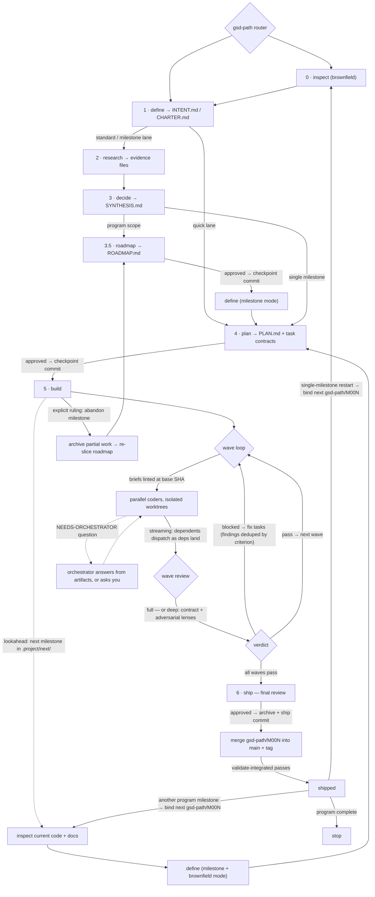

# GSD Path

A disk-backed project pipeline for AI coding agents. It turns a raw idea into
shipped code through gated phases — inspect, define, research, decide,
roadmap, plan, build, and ship — with every handoff written to `.project/`
so any session can resume from disk alone. A single milestone or a full
multi-milestone program: program flow adds a charter and roadmap above the
milestone loop. While a milestone builds, the next one can be planned in
parallel under `.project/next/` (lookahead); a building milestone can also be
abandoned on an explicit ruling, archiving its partial work for a re-slice.

**Supported hosts:** Codex, Claude Code, Grok, OpenCode, GitHub Copilot CLI,
Qwen Code, Antigravity CLI, Cursor, Zed, Kiro, and Kimi Code.

## Documentation

**Start at [DOCS.md](DOCS.md)** — install, use, understand, and update in one hub.

| Guide | Use when |
| --- | --- |
| **[DOCS.md](DOCS.md)** | Full map + FAQ (recommended) |
| **[QUICK.md](QUICK.md)** | First run checklist (~5 min) |
| **[FULL.md](FULL.md)** | Complete install-to-ship walkthrough |
| **[UPDATE.md](UPDATE.md)** | Refresh skills, hooks, or contracts |
| [WORKFLOW.md](WORKFLOW.md) | Phase-by-phase agent SOP |
| [HOOKS.md](HOOKS.md) | Optional archive/git guard hooks |
| [GUIDE.md](GUIDE.md) | Pointer to the guides above |

```bash
# New user
node scripts/install.mjs --all --dry-run && node scripts/install.mjs --all
cd your-repo && node scripts/install.mjs --all --project "$(pwd)"
# In agent: $gsd-path (Codex) or /gsd-path (most hosts)

# Already installed
node scripts/install.mjs --update
```

Interactive: `npx gsd-path` with no flags opens the OpenGSD wizard (pick hosts, scope, contracts, hooks; dry-run first)

npm (once published to npm): `npx gsd-path --all` · Help: `node scripts/install.mjs --help`

## Skills

Twelve canonical explicit-only skills are installed.
Invoke the **router** by default; use phase skills for one step only, or use the
discussion sidecar to talk through a question at any non-shipped phase.

| Skill | Role |
| --- | --- |
| `gsd-path` | Router — detects state, runs next phase |
| `gsd-path-inspect` | Phase 0 — brownfield codebase map + doc audit |
| `gsd-path-define` | Phase 1 — intent interview |
| `gsd-path-research` | Phase 2 — parallel evidence researchers |
| `gsd-path-decide` | Phase 3 — evidence → decisions |
| `gsd-path-roadmap` | Phase 3.5 — program: slice charter into milestone roadmap |
| `gsd-path-plan` | Phase 4 — waves and task contracts |
| `gsd-path-build` | Phase 5 — parallel coders + serial task landing |
| `gsd-path-ship` | Phase 6 — verify, approve, archive, and ship |
| `gsd-path-discuss` | Any-phase discussion with durable dialogue and answers |
| `gsd-path-docs-audit` | Standalone doc-vs-code drift check |
| `gsd-path-loop` | Standalone bounded loop runner driven by a LOOP.md spec |

Codex: `$gsd-path`, `$gsd-path-plan`, … · Other hosts: `/gsd-path`, `/gsd-path-plan`, …

## The flow



At any non-shipped phase, `/gsd-path-discuss` (or `$gsd-path-discuss` in
Codex) records the conversation in `.project/discuss/` without advancing or
editing the phase handoff. Required decisions carry a named owner and remain
pending until that phase records how it applied them; the router will not
advance past an unresolved required follow-up.

**Build, under the hood:**

- Task briefs are linted against the real base tree (`check_task_briefs.py`)
  before any agent is dispatched, and every coder runs a preflight — paths
  exist or are declared, interface contracts match siblings verbatim — so a
  wrong map dies in the first minute.
- Task isolation and landing go through `isolation.py`: named branches only,
  never a detached HEAD. A serial dispatch round works on the bound branch;
  a parallel round gets `gsd-path-task/<id>`.
- Dispatch streams: a dependent task starts the moment its dependencies
  land, never idling behind unrelated in-flight tasks. Task landing
  stays serial and every Verify reruns in the isolated worktree.
- Wave review depth is `full`, `verify-only`, or `deep` — two independent
  fresh-context reviewers (contract + adversarial lenses) that must both
  pass — and findings carry forward by criterion across fix cycles.
- A coder with an ambiguous contract asks `NEEDS-ORCHESTRATOR` instead of
  guessing; on hosts with a blocking ask/reply channel the worker stays
  alive for the answer.
- Roadmap and plan approvals are checkpoint commits, so planning work never
  sits uncommitted until build.

Invoke the router explicitly. It does not run on generic “continue the project”
prompts. Phase skills stop at their handoff; invoke the router again to continue.
The discussion sidecar is the exception: it can be invoked at any non-shipped
phase and returns only a durable conversation record.

**Brownfield** (existing code/docs) → inspect then define. **Greenfield** → define.
**Quick lane** (tiny scope) may skip research/decide — see [FULL.md](FULL.md).

For an explicit new-GitHub request, the router previews the owner, visibility,
default checkout, `gsd-path/M001` branch, and sibling linked worktree. A
journaled helper performs the approved creation and safely resumes a matching
partial remote/clone/worktree transaction; the default checkout stays clean.

## Handoff contract

```text
.project/
  STATE.md                    phase, branch, archive transaction
  REPOSITORY.md               persistent new-GitHub checkout/worktree binding
  CHARTER.md                  program scope and vetoes; never archives
  ROADMAP.md                  milestone slicing; never archives
  SYNTHESIS.md                program decisions (top level); never archives
  next/                       lookahead track: next milestone's artifacts during build
  intent/INTENT.md            goal, vetoes, constraints
  research/
    evidence-codebase.md      brownfield ground truth (inspect)
    DOCS-AUDIT.md             doc verdicts + remediation queue
    RESEARCH.md               dispatch manifest (dimensions researched/skipped)
    evidence-domain.md        domain evidence
    evidence-stack.md         stack evidence
    evidence-pitfalls.md      pitfalls evidence
    evidence-similar.md       similar projects evidence
    SYNTHESIS.md              gated decisions
  plan/PLAN.md                waves, dependencies, verify
  tasks/T###-slug.md          task contract: files, interface, criteria, base SHA, status
  review/wave-N.cycleC.md     wave review (deep: .contract.md + .adversarial.md)
  review/wave-N.cycleC.panel.md  optional cross-model wave panel
  review/PLAN-PANEL.md        optional cross-model plan panel
  review/final-gap-N.md       gap review
  review/FINAL.md             success-criteria audit
  review/PATCH-FINDINGS.md    patch-wave findings (when review blocks)
  discuss/DIALOGUE.md         any-phase dialogue transcript
  discuss/ANSWERS.md          durable discussion answers and decisions
  LESSONS.md                  optional carried-forward planning lessons
  archive/<NNN>-<slug>/       shipped milestones (read-only after ship)
```

Shipping moves milestone artifacts into `archive/` with a MANIFEST, merges the
milestone's `gsd-path/M00N` branch into `main`, and reports shipped only after
integration validates. Before any next-milestone files change, the router binds
a new `gsd-path/M00N` at the updated `origin/main`. `STATE.md`, `REPOSITORY.md`,
`LESSONS.md`, `next/`, and the program artifacts (`CHARTER.md`, `ROADMAP.md`,
top-level `SYNTHESIS.md`) remain active project metadata.

## Install (summary)

Node 18.17+. Validates package, backs up existing skills, rolls back on failure.
**Always** `--dry-run` first when unsure.

```bash
node scripts/install.mjs --all --dry-run
node scripts/install.mjs --all
node scripts/install.mjs --claude --cursor
node scripts/install.mjs --all --local
node scripts/install.mjs --all --project /path/to/project
node scripts/install.mjs --update
```

| Flag | User skills root | Invoke |
| --- | --- | --- |
| `--codex`, `--zed` | `~/.agents/skills` | `$gsd-path` / `/gsd-path` |
| `--claude` | `~/.claude/skills` | `/gsd-path` |
| `--cursor` | `~/.cursor/skills` (+ subagent) | `/gsd-path` |
| `--grok` | `~/.grok/skills` | `/gsd-path` |
| `--opencode` | OpenCode config `skills/` | `/gsd-path` (OpenCode v2 host) |
| `--copilot` | `~/.copilot/skills` | `/gsd-path` |
| `--qwen` | `~/.qwen/skills` | `/gsd-path` |
| `--antigravity` | Antigravity skills dir | `/gsd-path` |
| `--kiro` | `~/.kiro/skills` | `/gsd-path` |
| `--kimi` | `~/.kimi-code/skills` | `/gsd-path` |

`scripts/install.py` — global install in Python. See [FULL.md](FULL.md) and
[UPDATE.md](UPDATE.md) for `--hooks`, `--hooks-refresh`, `--local`, and host notes.

Optional **`--hooks`** with `--project` — [HOOKS.md](HOOKS.md).

Something off? `node scripts/install.mjs --doctor [--project PATH]` — read-only
health check of installs, guard hooks, and pipeline state.

## Agent execution

Define and build orchestrators run in the main task. Researchers, deciders,
planners, coders, and reviewers delegate via host-specific adapters. See
[FULL.md — Agent execution](FULL.md#agent-execution-how-work-is-delegated) for
the authoritative host API table and delegation rules.

`platforms/` is installer-only — not user-invoked skills.

## Repository layout

| Path | Purpose |
| --- | --- |
| `DOCS.md` | Documentation hub |
| `QUICK.md` | Quick start |
| `FULL.md` | Full guide |
| `UPDATE.md` | Updating |
| `HOOKS.md` | Guard hooks |
| `skills/` | Twelve canonical `gsd-path*` skills |
| `platforms/` | Host dispatch adapters |
| `scripts/install.mjs` | Installer (npm `gsd-path` bin) |
| `scripts/install.py` | Python installer |
| `AGENTS.md` | Operating rules (installed to projects) |
| `WORKFLOW.md` | Phase SOP (installed to projects) |
| `LICENSE` | MIT |
