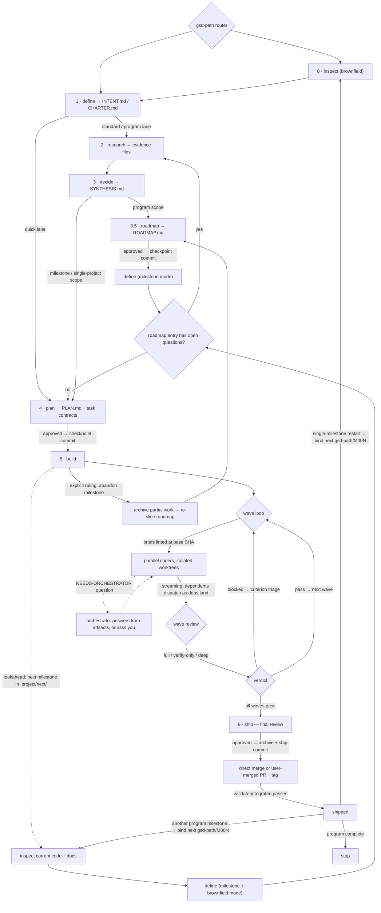

# GSD Path

A disk-backed project pipeline for AI coding agents. It turns a raw idea into
shipped code through gated phases — inspect, define, research, decide,
roadmap, plan, build, and ship — with every handoff written to `.project/`
so any session can resume from disk alone. A single milestone or a full
multi-milestone program: program flow adds a charter and roadmap above the
milestone loop. While a milestone builds, the next one can be planned in
parallel under `.project/next/` (lookahead); a building milestone can also be
abandoned on an explicit ruling, archiving its partial work for a re-slice.

**Supported hosts:** Codex, Claude Code, Grok, OpenCode, GitHub Copilot CLI,
Qwen Code, Antigravity CLI, Cursor, Zed, Kiro, Kimi Code, and Muse Code.
Support means the installer and dispatch contract exist. See the
[host trust matrix](https://github.com/open-gsd/gsd-path/blob/main/docs/trust-validation/HOST-MATRIX.md) for live milestone
proof and each host's guard tier.

<!-- release-docs -->
**Latest npm release:** [@opengsd/gsd-path@1.5.0](https://www.npmjs.com/package/@opengsd/gsd-path/v/1.5.0) — [release notes](CHANGELOG.md#150---2026-10-09)

**Recent highlights**
- record runtime hotfix provenance on the declaration
- add signed self-update
- add the Skills, Stats, Settings, and Environment pages and the setup wizard
- register the hosts, project operation, and env routes
- add project setup operations for the app

<!-- /release-docs -->

## Documentation

**Start at [DOCS.md](DOCS.md)** — install, use, understand, and update in one hub.

| Guide | Use when |
| --- | --- |
| **[DOCS.md](DOCS.md)** | Full map + FAQ (recommended) |
| **[QUICK.md](QUICK.md)** | First run checklist (~5 min) |
| **[FULL.md](FULL.md)** | Complete install-to-ship walkthrough |
| **[UPDATE.md](UPDATE.md)** | Refresh skills, hooks, or contracts |
| [WORKFLOW.md](WORKFLOW.md) | Phase-by-phase agent SOP |
| [HOOKS.md](HOOKS.md) | Optional archive/git guard hooks |
| [Jev screening](skills/gsd-path/references/jev-review.md) | Optional evidence screening; disabled by default, no SDK required |
| [daemon/app/README.md](daemon/app/README.md) | Desktop app: develop, release, and updates |
| [daemon/README.md](daemon/README.md) | Monitor daemon: routes, configuration, and manual setup |
| [CHANGELOG.md](CHANGELOG.md) | npm package release notes |
| [daemon/app/CHANGELOG.md](daemon/app/CHANGELOG.md) | Desktop app release notes |
| [RELEASE.md](RELEASE.md) | Maintainer CI and npm release cycle |
| [GUIDE.md](GUIDE.md) | Pointer to the guides above |

## What's new — October 2, 2026

These changes are merged into the source checkout; npm installs use the latest
published release.

- **Desktop app (pre-release):** one app for macOS, Windows, and Linux shows
  your projects, manages skills in each coding agent, and updates itself. See
  [Desktop app](#desktop-app).
- **Skills from the published release:** the monitor installs skills from the
  npm release, checks the download against the registry's sha512, and refuses
  one that does not match. A release picker lets you stay on an older version.
- **Safer monitor writes:** a monitor started by the app accepts changes only
  with the app's local token, so another web page cannot change your setup.
- **Environment editor:** edit a project's `.env` files with values masked and
  a diff before each save.
- **Usage charts:** tokens and cost per day, time per phase, tasks per wave,
  and verify history. Missing data shows as missing, never as zero.
- **Muse Code** is a supported host.

## Install from npm

Requires **Node.js 18.17+** for the npm installer and **Python 3.9+** for
project contracts and pipeline helpers. Install and sign in to a supported
coding-agent host separately; GSD Path installs its skills, not the host itself.

**Windows** runs natively; WSL is not required. Install
[Git for Windows](https://git-scm.com/download/win): git hooks and task Verify
commands run in its Git Bash, never the System32 WSL launcher (`GSD_PATH_BASH`
overrides the path). Install a real Python from python.org or
`winget install Python.Python.3.12`; the Microsoft Store `python` alias stub
does not count. The installer accepts `python3`, `python`, or the `py -3`
launcher. For deep managed-worktree paths, turn on long paths
(`git config --global core.longpaths true` and Windows' `LongPathsEnabled`);
`--doctor` warns about both. Git for Windows defaults to
`core.autocrlf=true`, so project installs add a managed
`/.project/** text eol=lf` rule to the repository's local `.git/info/attributes`
(never committed; delete the `# gsd-path:begin` block to remove it). That keeps
pipeline state LF in every worktree while product files follow your setting.

The public npm package is **[@opengsd/gsd-path](https://www.npmjs.com/package/@opengsd/gsd-path)**.

```bash
# Interactive installer: choose hosts, install scope, contracts, and hooks
npx @opengsd/gsd-path@latest

# Or preview and install skills for all supported hosts
npx @opengsd/gsd-path@latest --all --dry-run
npx @opengsd/gsd-path@latest --all

# Add contracts and the status runtime to your project
npx @opengsd/gsd-path@latest --all --project /path/to/your-repo

# Update existing installs
npx @opengsd/gsd-path@latest --update
npx @opengsd/gsd-path@latest --update --project /path/to/your-repo
```

Use host flags such as `--claude --codex` instead of `--all` to select hosts.
For project-local skills, run from your project directory and add `--local`
to install and update commands. `--project PATH` selects where contracts are
written; it does not change the directory used by `--local`. If the repo
already has an `AGENTS.md`, the install adds a marked GSD Path block and keeps
your text; see [project contracts](UPDATE.md#update-project-contracts). Run
`npx @opengsd/gsd-path@latest --help` for all options. After installing, invoke
`$path` in Codex or `/path` on slash-command hosts to start the pipeline.
See [Install (summary)](#install-summary) for the host list and source-checkout commands.
The npm command installs the latest published release; a source checkout may
contain newer changes.

### Start your first project

1. Open your project folder in your coding-agent host. Existing repositories
   need Git; GitHub repository creation and pull-request operations also need
   an authenticated GitHub CLI (`gh`). The default branch of `origin` can have
   any name: Path records it at initialization and ships onto it. This guide
   calls it `main`; see [default branch](WORKFLOW.md#default-branch).
   Pull-request
   shipping supports GitHub.com only. On GitLab, Gitea, or GitHub Enterprise
   Server, use the [`external-landing` mode](WORKFLOW.md#integration) when
   the default branch accepts merge requests only.
2. Start or reload the host session so it discovers the installed skills.
3. Invoke `$path` in Codex, or `/path` on slash-command hosts. The router
   identifies the project and guides you through the required inputs and approvals.
4. Resume later from the same folder with the router. Use `$path status`
   (Codex) or `/path status` to inspect progress without advancing.

For an unattended quick-lane run, invoke `$gsd-path --pre-approve intent,plan`
in Codex or `/gsd-path --pre-approve intent,plan` on slash-command hosts before
milestone intent approval. This grants those two gates for one milestone when
their checks pass. Required answers, failed checks, and other approval gates
still pause for you. Shipping always needs manual approval.

For a missing skill or an install problem, run:

```bash
npx @opengsd/gsd-path@latest --doctor --project /path/to/your-repo
```

Add `--local` when checking project-local skills, from that project directory.
See [QUICK.md](QUICK.md) for the first-run checklist and [HOOKS.md](HOOKS.md)
for optional Git and host guard hooks.

For project-owned model and effort choices, see the
[dispatch model policy](skills/gsd-path/references/model-policy.md).

Use `$path config` (Codex) or `/path config` to view and change user defaults or
project settings. Dashboard users can open **Settings → Path settings** for the
same shipping, model/effort, and future review-panel controls. See
[Path settings](skills/gsd-path/references/config.md) for precedence and locks.

## Desktop app

The **OpenGSD Path app** shows your projects without opening each project's
`.project/` files, and manages the Path setup on your computer. It is a
pre-release for testers.

**Get it:** download the installer for your system from the newest `app-v`
entry on the [releases page](https://github.com/open-gsd/gsd-path/releases):
`.dmg` (macOS, Apple Silicon or Intel), `.msi` (Windows), `.deb` or AppImage
(Linux). The app needs Python 3.9+ and Git; its first screen checks for both
and shows the fix when one is missing.

macOS builds are signed with a Developer ID and notarized by Apple from 0.1.1
on, so they open without an approval in Privacy & Security. Windows builds have
no code signature yet: SmartScreen shows a warning; choose **More info → Run
anyway**.

What the app does:

- **Projects:** blocked, active, and shipped work with milestone and phase
  progress, tasks, last activity, and usage. A project page shows its
  roadmap, tasks, success criteria, reviews, verification history, files at
  any Git version, and full recorded evidence.
- **Skills:** which coding agents have Path skills, at which version, with
  preview, install, update, and uninstall. Every write shows a preview or a
  plan first.
- **Project setup:** runtime version, guard hooks, health check, and, for a
  multi-repo coordinator, member hooks and marker repair.
- **Settings:** updates, Path settings (shipping mode, models, review panel),
  watched folders, model prices, launch at login, and appearance.
- **Stats** and the per-project **Environment** editor.
- **Tray:** a compact project list, items that need attention, and controls
  to start, restart, and quit.

The app only watches and sets up. It never advances a phase; approvals and
rulings stay in your agent. It updates itself: it checks a signed update file,
asks before it installs, and refuses an update whose signature does not match.

Background monitoring is read-only. The app starts a local monitor (the
daemon) and stops it on quit. See the [app guide](daemon/app/README.md) and the
[daemon guide](daemon/README.md).

### Manual monitor (without the app)

From a source checkout you can still run the monitor and its browser
dashboard without the app. It requires Python 3.9+:

```bash
git clone https://github.com/open-gsd/gsd-path.git
cd gsd-path
PYTHONPATH=daemon python3 -m gsd_daemon install --dry-run
PYTHONPATH=daemon python3 -m gsd_daemon install
```

On Windows, use PowerShell in the `gsd-path` folder. The last command starts
the monitor for this session; it starts by itself at later logins:

```powershell
$env:PYTHONPATH = "daemon"
python -m gsd_daemon install --dry-run
python -m gsd_daemon install
Start-Process "$env:APPDATA\Microsoft\Windows\Start Menu\Programs\Startup\gsd-path-daemon.lnk"
```

Then open **http://127.0.0.1:8765**. The first launch of the desktop app
removes this older autostart entry so only one monitor runs. See the
[daemon guide](daemon/README.md) for platform details, configuration, and
usage pricing.

## Skills

Canonical explicit-only skills are installed.
Invoke the **router** by default; use phase skills for one step only, or use a
sidecar to discuss, diagnose, or undo without advancing.

| Skill | Role |
| --- | --- |
| `path` | Router short name — same as `gsd-path` (`/path`, `$path`) |
| `gsd-path` | Router — detects state, runs next phase (`status` reports without advancing) |
| `gsd-path-inspect` | Phase 0 — brownfield codebase map + doc audit |
| `gsd-path-define` | Phase 1 — intent definition |
| `gsd-path-research` | Phase 2 — parallel evidence researchers |
| `gsd-path-decide` | Phase 3 — evidence → decisions |
| `gsd-path-roadmap` | Phase 3.5 — program: slice charter into milestone roadmap |
| `gsd-path-plan` | Phase 4 — waves and task contracts |
| `gsd-path-build` | Phase 5 — parallel coders + serial task landing |
| `gsd-path-ship` | Phase 6 — verify, approve, archive, and ship |
| `gsd-path-discuss` | Any-phase discussion with durable dialogue and answers |
| `gsd-path-docs-audit` | Standalone doc-vs-code drift check |
| `gsd-path-loop` | Standalone bounded loop runner driven by a LOOP.md spec |
| `gsd-path-forensics` | Read-only stuck-pipeline diagnosis |
| `gsd-path-migrate` | [Import GSD Core work and review hook coexistence](MIGRATE.md) |
| `gsd-path-undo` | Helper-owned undo of unpublished pipeline work |

See [invocation by host](#install-summary). Phase names keep the `gsd-path-` prefix.

## The flow


```mermaid
flowchart TD
    R{"gsd-path router"} --> I["0 · inspect (brownfield)"]
    R --> D["1 · define → INTENT.md / CHARTER.md"]
    I --> D
    D -->|"standard / program lane"| RE["2 · research → evidence files"]
    D -->|"quick lane"| P
    RE --> DE["3 · decide → SYNTHESIS.md"]
    DE -->|"program scope"| RM["3.5 · roadmap → ROADMAP.md"]
    RM -->|"approved → checkpoint commit"| DM["define (milestone mode)"]
    DM --> MQ{"roadmap entry has open questions?"}
    MQ -->|"yes"| RE
    MQ -->|"no"| P["4 · plan → PLAN.md + task contracts"]
    DE -->|"milestone / single-project scope"| P
    P -->|"approved → checkpoint commit"| B["5 · build"]
    B --> W{"wave loop"}
    W -->|"briefs linted at base SHA"| C["parallel coders, isolated worktrees"]
    C -->|"streaming: dependents dispatch as deps land"| V{"wave review"}
    V -->|"full / verify-only / deep"| F{"verdict"}
    F -->|"blocked → criterion triage"| W
    F -->|"pass → next wave"| W
    F -->|"all waves pass"| S["6 · ship — final review"]
    C -.->|"NEEDS-ORCHESTRATOR question"| O["orchestrator answers from artifacts, or asks you"]
    O -.-> C
    B -.->|"lookahead: next milestone in .project/next/"| MI["inspect current code + docs"]
    MI --> MB["define (milestone + brownfield mode)"]
    MB --> MQ
    B -->|"explicit ruling: abandon milestone"| AB["archive partial work → re-slice roadmap"]
    AB --> RM
    S -->|"approved → archive + ship commit"| MG["direct merge or user-merged PR + tag"]
    MG -->|"validate-integrated passes"| A["shipped"]
    A -->|"another program milestone → bind next gsd-path/M00N"| MI
    A -->|"single-milestone restart → bind next gsd-path/M00N"| I
    A -->|"program complete"| PC["stop"]
```

Starting in an empty folder without Git leaves that folder unchanged until
repository setup. The router asks whether to create a new GitHub repository or
use an existing repository. For a new repository, approve the exact owner/name,
visibility, default-checkout path, `gsd-path/M001` branch, and linked-worktree
path before creation. The starting folder is proposed as the linked worktree,
with a distinct default checkout beside it, so the agent keeps working where
it started. Only an approved empty directory can be reused; nonempty folders
and symlinks remain protected. Pipeline state is created after repository
setup. See the [repository setup procedure](WORKFLOW.md#new-github-repository-creation).

For an existing Git repository, initialization writes STATE.md first. Before
entering inspect or define, the router fetches `origin/main`, creates or adopts
`gsd-path/M001` there, and records the binding in state. Build only uses that
recorded milestone branch; it never creates or selects one. See the
[phase workflow](WORKFLOW.md#phase-0--inspect-gsd-path-inspect).

At any non-shipped phase, `/gsd-path-discuss` (or `$gsd-path-discuss` in
Codex) records the conversation in `.project/discuss/` without advancing or
editing the phase handoff. Required decisions carry a named owner and remain
pending until that phase records how it applied them; the router will not
advance past an unresolved required follow-up.

**Build, under the hood:**

- For intent corrections or structural plan repair during a blocked build,
  follow the [build recovery contract](skills/gsd-path/references/build-recovery.md).
- Task briefs are linted against the real base tree (`check_task_briefs.py`)
  before any agent is dispatched, and every coder runs a preflight — paths
  exist or are declared, interface contracts match siblings verbatim — so a
  wrong map dies in the first minute.
- Task isolation and landing go through `isolation.py`: named branches only,
  never a detached HEAD. A serial dispatch round works on the bound branch;
  a parallel round gets `gsd-path-task/<id>`.
- Dispatch streams: a dependent task starts the moment its dependencies
  land, never idling behind unrelated in-flight tasks. Task landing
  stays serial and every Verify reruns in the isolated worktree.
- Wave review depth is `full`, `verify-only`, or `deep`; findings carry
  forward by criterion across fix cycles. Each depth's writer and evidence
  rules live in the canonical [build contract](skills/gsd-path-build/SKILL.md).
  Optional skeptic triage for blocked `deep` reviews is defined in
  [WORKFLOW.md](WORKFLOW.md#phase-4--plan-gsd-path-plan).
- A coder with an ambiguous contract asks `NEEDS-ORCHESTRATOR` instead of
  guessing; on hosts with a blocking ask/reply channel the worker stays
  alive for the answer.
- Roadmap and plan approvals are checkpoint commits, so planning work never
  sits uncommitted until build.

Invoke the router explicitly to start or advance a phase. Once a project has an
owned `.project/STATE.md`, a plain prompt such as “continue the project” answers
read-only with the current handoff and uses the runtime’s `handoff.next`; it
never advances a phase or edits state. An active router continues across completed phases
until required input, approval, or a block. A phase invoked directly stops at
its handoff; invoke the router again to continue. Chat and the dashboard use
the same executable phase handoff from the status runtime.
The discussion sidecar is the exception: it can be invoked at any non-shipped
phase and returns only a durable conversation record.

The router classifies **brownfield**, **greenfield**, owned, and orphaned
project state before routing; see [DOCS.md](DOCS.md#faq). Brownfield →
inspect then define. Greenfield → define. It does not infer the verdict from
a directory listing.
**Quick lane** (tiny scope) may skip research/decide — see [FULL.md](FULL.md).

For an explicit new-GitHub request, the router previews the owner, visibility,
default checkout, `gsd-path/M001` branch, and sibling linked worktree. A
journaled helper performs the approved creation and safely resumes a matching
partial remote/clone/worktree transaction; the default checkout stays clean.

## Multi-repo milestones

One project can change several repositories in the same milestone. The
**coordinator** repo holds `.project/` and runs the pipeline; each other repo
is a **member** listed in `.project/MEMBERS.md`. A member needs a GitHub.com
`origin`. Its default branch can have any name, and it can differ from the
default branch of the coordinator and of the other members. See
[ADR 0002](docs/adr/0002-multi-repo-coordinator.md) for the design.

`MEMBERS.md` has one section per member, in ship order. `members.py` writes
it; do not edit it by hand:

```markdown
## web
Checkout: /absolute/path/to/web
Remote: https://github.com/acme/web.git
Integration: default
Default branch: master
```

`Default branch` is the member's default branch on `origin`. `members.py add`
records it one time, from the member's local `origin/HEAD`; run
`git remote set-head origin --auto` in the member first. A section without
the field means `main`. See [default branch](WORKFLOW.md#default-branch).

- Add members at a milestone boundary: ask the router to add an existing repo
  (`members.py add`) or to create a new one (`members.py add --create`, after
  you approve the exact owner, name, visibility, and checkout; a new
  repository uses `main`). For optional
  guard hooks, install them in the member with
  `npx @opengsd/gsd-path@latest --member-of <coordinator> --project <member>`.
- The planner gives each member task `repo: <member>`; one task changes one
  repo. Project Verify runs from the coordinator and reaches a member as
  `../<member>`.
- Build works in Path-owned member branches `gsd-path/<project>-M00N` and
  records each member landing in the coordinator. The final review names each
  member's reviewed HEAD.
- Ship closes members in order before the coordinator: `close-members` merges
  each member in its own `direct` or `pull-request` mode and tags it
  `milestone/<project>-<archive>`, then the ship commit records each member.
  A pull-request member waits for you to merge it. The next milestone retires
  the member branches.
- `members.py detect --checkout <path>` reports whether a repo is a member.

Out of scope: submodules, one task across two repos, non-GitHub remotes, and
an atomic close across repos.

## Handoff contract

```text
.project/
  STATE.md                    phase, branch, archive transaction
  REPOSITORY.md               persistent new-GitHub checkout/worktree binding
  CHARTER.md                  program scope and vetoes; never archives
  ROADMAP.md                  milestone slicing; never archives
  SYNTHESIS.md                program decisions (top level); never archives
  next/                       lookahead track: next milestone's artifacts during build
  intent/INTENT.md            goal, vetoes, constraints, surfaces
  research/
    evidence-codebase.md      brownfield ground truth (inspect)
    DOCS-AUDIT.md             doc verdicts + remediation queue
    RESEARCH.md               dispatch manifest (dimensions researched/skipped)
    evidence-domain.md        domain evidence
    evidence-stack.md         stack evidence
    evidence-pitfalls.md      pitfalls evidence
    evidence-similar.md       similar projects evidence
    SYNTHESIS.md              gated decisions
  plan/PLAN.md                waves, dependencies, surface contract, verify
  tasks/T###-slug.md          task contract: files, interface, criteria, base SHA, status
  review/                      review evidence; see WORKFLOW.md#handoff-contract
  discuss/DIALOGUE.md         any-phase dialogue transcript
  discuss/ANSWERS.md          durable discussion answers and decisions
  LESSONS.md                  optional carried-forward planning lessons
  archive/<NNN>-<slug>/       shipped milestones (read-only after ship)
```

Shipping moves milestone artifacts into `archive/` with a MANIFEST. It then
either merges the milestone's `gsd-path/M00N` branch into `main` directly or
opens/reuses a GitHub PR and waits for its user-controlled merge. Path reports
shipped only after a two-parent merge and the milestone tag validate. Before
any next-milestone files change, the router binds
a new `gsd-path/M00N` at the updated `origin/main`. `STATE.md`, `REPOSITORY.md`,
`LESSONS.md`, `next/`, and the program artifacts (`CHARTER.md`, `ROADMAP.md`,
top-level `SYNTHESIS.md`) remain active project metadata.

## Install (summary)

Node 18.17+ for the Node installer; Python 3.9+ for project installs and pipeline
helpers. Validates package,
backs up existing skills, and rolls back on failure.
**Always** `--dry-run` first when unsure.

The commands below run from a source checkout. For npm, replace
`node scripts/install.mjs` with `npx @opengsd/gsd-path@latest`.

```bash
node scripts/install.mjs --all --dry-run
node scripts/install.mjs --all
node scripts/install.mjs --claude --cursor
node scripts/install.mjs --all --local
node scripts/install.mjs --all --project /path/to/project
node scripts/install.mjs --update
node scripts/install.mjs --all --update --project /path/to/project   # refresh .gsd-path/; keeps contracts
```

| Flag | User skills root | Invoke |
| --- | --- | --- |
| `--codex`, `--zed`, `--muse` | `~/.agents/skills` | Codex: `$path` or `$gsd-path`; Zed, Muse: `/path` or `/gsd-path` |
| `--claude` | `~/.claude/skills` | `/path` or `/gsd-path` |
| `--cursor` | `~/.cursor/skills` (+ subagent) | `/path` or `/gsd-path` |
| `--grok` | `~/.grok/skills` | `/path` or `/gsd-path` |
| `--opencode` | OpenCode config `skills/` | `/path` or `/gsd-path` (OpenCode v2 host) |
| `--copilot` | `~/.copilot/skills` | `/path` or `/gsd-path` |
| `--qwen` | `~/.qwen/skills` | `/path` or `/gsd-path` |
| `--antigravity` | Antigravity skills dir | `/path` or `/gsd-path` |
| `--kiro` | `~/.kiro/skills` | `/path` or `/gsd-path` |
| `--kimi` | `~/.kimi-code/skills` | `/path` or `/gsd-path` |

OpenCode stable: ask to load and use the `gsd-path` skill.
`gsd-path` remains the canonical router name; `path` is its short menu alias.
For a single phase, use `$gsd-path-plan` in Codex or `/gsd-path-plan` on slash hosts.

`scripts/install.py` — Python install, including `--local` and `--update`.
The Node CLI remains the interactive and npm entry point. See [FULL.md](FULL.md) and
[UPDATE.md](UPDATE.md) for `--hooks`, `--hooks-refresh`, `--local`, and host notes.

Optional **`--hooks`** with `--project` — [HOOKS.md](HOOKS.md).

Something off? `node scripts/install.mjs --doctor [--project PATH]` — read-only
health check of installs, guard hooks, and pipeline state.

## Agent execution

Define and build orchestrators run in the main task. Researchers, deciders,
planners, coders, and reviewers delegate via host-specific adapters. See
[FULL.md — Agent execution](FULL.md#agent-execution-how-work-is-delegated) for
the authoritative host API table and delegation rules.

`platforms/` is installer-only — not user-invoked skills.

## Testing

Contributors and CI use one offline gate. See **[TEST_ENVIRONMENT.md](TEST_ENVIRONMENT.md)** for prerequisites, tiers, fixtures, and troubleshooting.

```bash
make install && make verify    # same path as GitHub Actions CI
```

## Repository layout

| Path | Purpose |
| --- | --- |
| `DOCS.md` | Documentation hub |
| `QUICK.md` | Quick start |
| `FULL.md` | Full guide |
| `UPDATE.md` | Updating |
| `HOOKS.md` | Guard hooks |
| `skills/` | Canonical skills and generated aliases declared in [the resource manifest](scripts/skill-resources.json) |
| `platforms/` | Host dispatch adapters |
| `daemon/` | Project monitor, dashboard, and tray apps |
| `scripts/install.mjs` | Installer (npm `gsd-path` bin) |
| `scripts/install.py` | Python installer |
| `AGENTS.md` | Operating rules (installed to projects) |
| `WORKFLOW.md` | Phase SOP (installed to projects) |
| `TEST_ENVIRONMENT.md` | Local/CI test setup and tiers |
| `fixtures/` | Sample `.project/` pipeline for manual runs |
| `LICENSE` | MIT |
